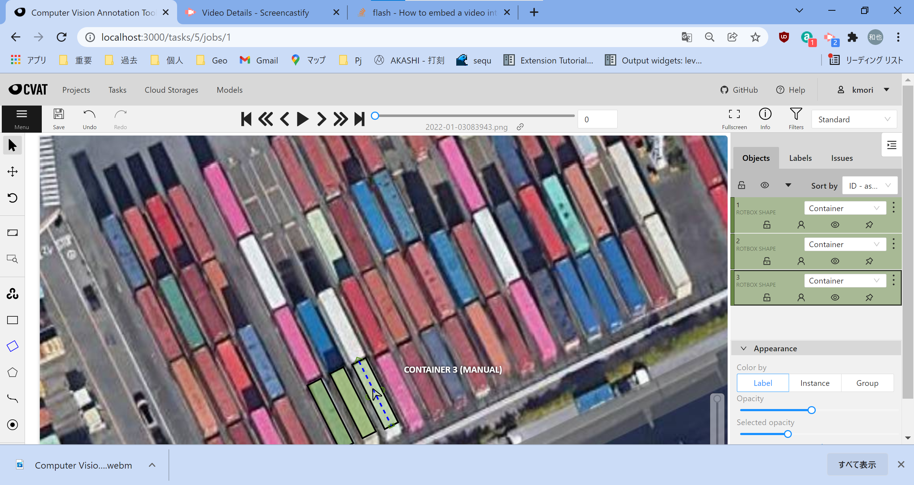

# CVAT with Rotated Bounding Box support (rotbox)

This project is one of the forks of CVAT implementing Rotated Bounding Box.
It seems an official version of Rotated Bounding box support is scheduled
as v2.0.

This project is not following the official version, so this version is
completely different from the official version as of its specification
and dataformat.

A new datatype is introduced for rotated bounding box annotation. The
internal format of rotbox is a polygon with 4 points which has constraint
of making a rectangular shape.

The shape 'rotbox' is a proprietary format.
If you want import other shape such as 'polygon's as 'rotbox'es,
you can write your own converter into cvat annotation.xml file.
A 'rotbox' element is just like a 'polygon' element which has
'point' attribute to represent 4 corner points of its rectanglar
shape. Also 'rotbox' element has a few other attributes such as
'cx', 'cy', 'width', 'height', and 'angle'. But these attributes
are not used at import time. These proprietary attributes can be
ommitted.

An example of annotation.xml in cvat dataset zip file is
like this:
```
<?xml version="1.0" encoding="utf-8"?>
<annotations>
  <version>1.1</version>
  <meta> ... </meta>
  <image id="0" name="2022-01-03083943.png" width="1254" height="828">
    <rotbox label="Container"
      occluded="0" source="manual"
      points="602.10,202.77;601.43,398.47;199.73,397.10;200.39,201.41"
      cx="400.91" cy="299.94" width="401.71" height="195.70" angle="-179.81"
      z_order="0">
    </rotbox>
    <rotbox label="Container"
      occluded="0" source="manual"
      points="602.04,399.42;602.04,203.73;1002.36,203.71;1002.37,399.41"
      cx="802.20" cy="301.57" width="400.32" height="195.70" angle="-0.00"
      z_order="0">
    </rotbox>
  </image>
</annotations>
```

## A brief operation manual

* Draw a rotbox shape.
  1. Drag and draw a rectangle's center line.
  2. Resize its width dragging one of half circle shaped handles shown on sides.
  3. Drag a head handle or a tail handle to adjust its angle.
  4. Click an arrow displayed in the center to flip its direction.
  5. Shift + Click it to flip its width and height.

[](./site/static/cvat-rotbox-usage.mp4)